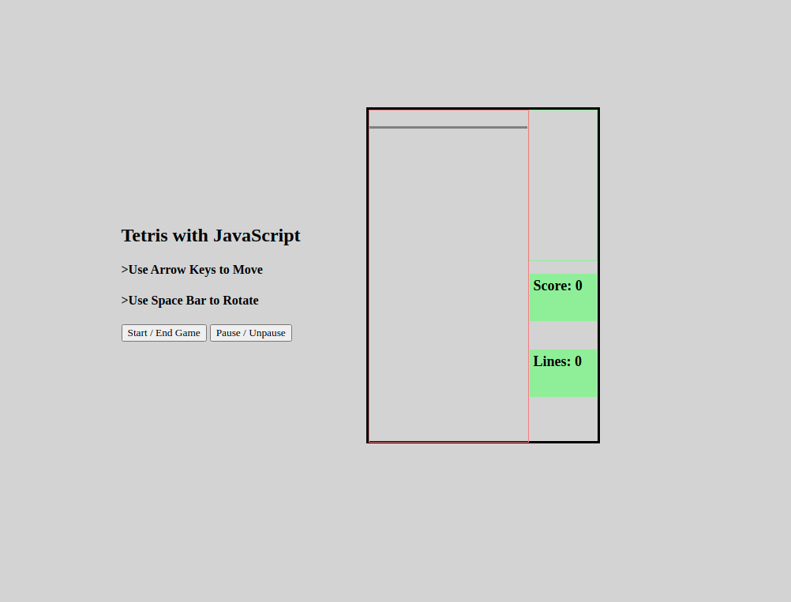

# Tetris with grids   

Decide grid grid dimensions
Create 5 tetrominos each with 4 rotations
L, T, O, Z, I
move tetrios down by undrawing and drawing it in divs
generate a random tetrios, queue up the tetrios / display the next one coming
moves down every 1/4 of a second
rotate block when pressing space.
left arrow moves left, right arrow moves right, down arrow moves down faster
once it hits tetrios is on grid where next grids is bottom or taken up then stop
blocks on bottom if they are in a row, clear and add 100 points
if tetrios blocks reach celing of grid then game over

querySelector()
addEventListener()
Array.from()
getElementsByClassName()
Math.floor()
Math.randomforEach()
classList.contains()
classList.add()
classList.remove()
setInterval()
clearInterval()
some()
style.backgroundImage
splice()
concat()
appendChild()
arrow functions
